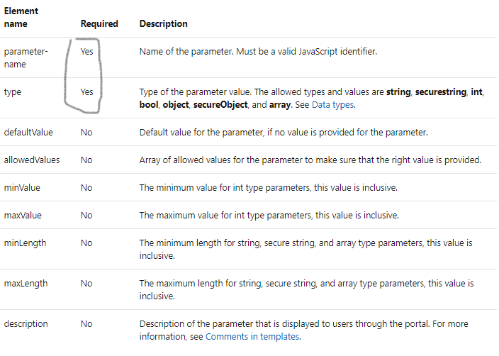

## Arm Template

# main concept in template
``` Template format is json ```
```
{
  "$schema": "https://schema.management.azure.com/schemas/2015-01-01/deploymentTemplate.json#",
  "contentVersion": "",
  "apiProfile": "",
  "parameters": {  },
  "variables": {  },
  "functions": [  ],
  "resources": [  ],
  "outputs": {  }
}
```

## $schema:
```
Location of the JSON schema file that describes the version of the template language.

1. For resource group deployments, use: https://schema.management.azure.com/schemas/2015-01-01/deploymentTemplate.json#

2. For subscription deployments, use: https://schema.management.azure.com/schemas/2018-05-01/subscriptionDeploymentTemplate.json#

```
## contentVersion :
```
Version of the template (such as 1.0.0.0). You can provide any value for this element. Use this value to document significant changes in your template. When deploying resources using the template, this value can be used to make sure that the right template is being used.

```

## apiprofile : [Refer for Documentation](https://docs.microsoft.com/en-in/azure-stack/user/azure-stack-version-profiles?view=azs-1910)


* API profiles are used to represent a set of Azure resource providers and their API versions.
* API profiles were created for you to create templates across multiple Azure clouds. Profiles provide a compatible and stable interface.
* Profiles are released four times a year.
* Three profile naming conventions are used:
    * latest   
        * Contains the most recent API versions released in global Azure.
    * yyyy-mm-dd-hybrid 
        * Released bi-annually, this release focuses on consistency and stability across multiple clouds. This profile targets optimal Azure Stack Hub compatibility.
    * yyyy-mm-dd-profile 
        * Balances optimal stability and the latest features.

## Parameters

* In the parameters section of the template, you specify which values you can input when deploying the resources. You're limited to 256 parameters in a template. 
* You can reduce the number of parameters by using objects that contain multiple properties.
    * The available properties for a parameter are:
```
{
    "parameters": {
        "<parameter-name>" : {
          "type" : "<type-of-parameter-value>",
          "defaultValue": "<default-value-of-parameter>",
          "allowedValues": [ "<array-of-allowed-values>" ],
          "minValue": <minimum-value-for-int>,
          "maxValue": <maximum-value-for-int>,
          "minLength": <minimum-length-for-string-or-array>,
          "maxLength": <maximum-length-for-string-or-array-parameters>,
          "metadata": {
            "description": "<description-of-the parameter>"
          }
        }
      }
}

```



#### [clikhere for more documentation](https://docs.microsoft.com/en-us/azure/azure-resource-manager/templates/template-syntax#parameters)

## variables :

* In the variables section, you construct values that can be used throughout your template. You don't need to define variables, but they often simplify your template by reducing complex expressions.

* The following example shows the available options for defining a variable:

```
"variables": {
  "<variable-name>": "<variable-value>",
  "<variable-name>": {
    <variable-complex-type-value>
  },
  "<variable-object-name>": {
    "copy": [
      {
        "name": "<name-of-array-property>",
        "count": <number-of-iterations>,
        "input": <object-or-value-to-repeat>
      }
    ]
  },
  "copy": [
    {
      "name": "<variable-array-name>",
      "count": <number-of-iterations>,
      "input": <object-or-value-to-repeat>
    }
  ]
}

```

