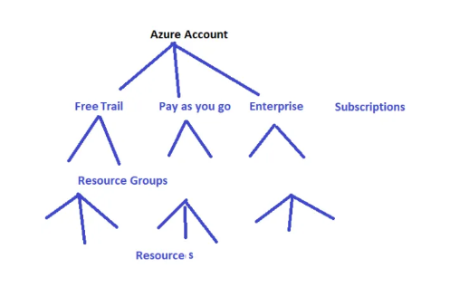
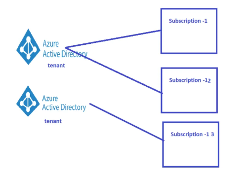

## Azure Active Directory
#### Azure Account, Subscriptions and Resource Groups


* Hierarchy is Azure Account can have multiple subscriptions

* Each Subscription can have multiple Resource Groups

* Each Resource Group can have multiple Resources

* Users need to login and create resources, so we need a platform for Identity

* Each Subscription is linked with only one Azure Active Directory(also referred as tenant)



* for more [info here](https://directdevops.blog/2019/01/28/azure-account-subscriptions/)

### What is Azure Active Directory
* Azure Active Directory (AAD) is Identity Platform.
* Its not Windows Active Directory Hosted on Azure Cloud.
* AAD Can give access to
    * Azure
    * Office 365
    * Applications (Mobile)

* In one simple Statement AAD is Identity as a Service
* AAD should be able to authenticate users and give then Authorizations. Users can be from
    * Windows Active Directory
    * Any other Directory Services
    * Any other OAUTH Based Identity Provider
    * Many other cases
#### AAD Major UseCases
* User Management (Authentication)
* Permission Management (Authorization/ RBAC )
* Active Directory Integrations
* Active Directory Federations
* Business To Business (B2B)
* Business To Consumer (B2C)


#### Azure Active Directory
    Users
    Groups
#### AAD RBAC
Can be applied at
    Subscription
    Resource Group
    Resource Level
#### Roles are
    Built in
    Custom
#### Popular Roles are
    Global Administrator
    Owner
    Co Owner
    Contributor
    Reader

* Roles assigned are inherited from parents to children
    * Roles assigned at Resource Groups are inherited to Resources
    * Roles assigned at Subscription level are inherited to Resource Groups and further to Resources.
    * User can add the new role assignments at Resource Group/Resource Level to change from inherited assignments
    * For further Reading, [Refer Here](https://docs.microsoft.com/en-us/azure/role-based-access-control/rbac-and-directory-admin-roles)


[Refer-for-more](https://directdevops.blog/2019/11/16/azure-classroom-series-16-nov-2019/)


## Create multiple user using [UserCreateTemplate.csv](UserCreateTemplate.csv)

#### Requried format 

```version:v1.0,,,,```
----
```
Name (example: Chris Green) [displayName] *,
User name (example: chris@contoso.com) [userPrincipalName] *,
Initial password [passwordProfile] *,
Block sign in (Yes/No) [accountEnabled] *,
First name [givenName],Last name [surname],
Job title [jobTitle],
Department [department],
Usage location [usageLocation],
Street address [streetAddress],
State or province [state],
Country or region [country],
Office [physicalDeliveryOfficeName],
City [city],
ZIP or postal code [postalCode],
Office phone [telephoneNumber],
Mobile phone [mobile]
```

---
#### Example:

```
username,user@domain.onmicrosoft.com,password,no,firstname,lastname,Role,department,location,streat_address,state,
country,company,companylocation,postal-pin-code,telephone,mobilenumber

````


# custom Role in Json format

```
{
    "properties": {
        "roleName": "Name of the role",
        "description": "Description",
        "assignableScopes": [
            "/subscriptions/79ece882-8abc-4219-ab3d-8c27a293e1ab"
        ],
        "permissions": [
            {
                "actions": [
                    "*"
                ],
                "notActions": [
                    "Microsoft.Authorization/*/Delete",
                    "Microsoft.Authorization/*/Write",
                    "Microsoft.Authorization/elevateAccess/Action",
                    "Microsoft.Blueprint/blueprintAssignments/write",
                    "Microsoft.Blueprint/blueprintAssignments/delete"
                ],
                "dataActions": [],
                "notDataActions": []
            }
        ]
    }
}

``` 
