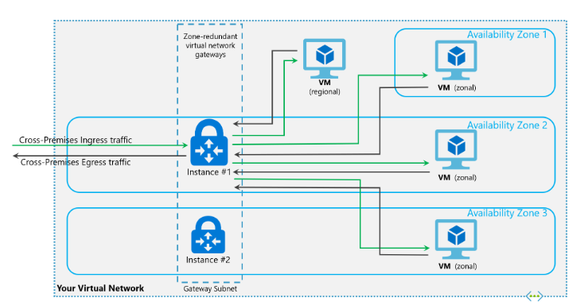

## Azure Networking 

#### Defination Network
    Networking is defined as the act of making contact and exchanging information with other people, groups and institutions to develop mutually beneficial relationships, or to access and share information between computers.

# Example Network
## The pic shows how networks used 
#### 1.Normal used for communcation
    its failure due to leekage of data
    the length of network is too big
    communcation leake in before reached


#### 2.Improve communcation  http
    length of network is divided into multiple camps
    the information transport in different ways
    but here the leak of information in camps 


#### 3.https
    the information is transver in different ways
    the data have secure because of provide a security layer to the network
    the information now safe to communication


## What is Azure Virtual Network
* Azure Virtual Network (VNet) is the fundamental building block for your private network in Azure. VNet enables many types of Azure resources, such as Azure Virtual Machines (VM), to securely communicate with each other, the internet, and on-premises networks. 
* VNet is similar to a traditional network that you'd operate in your own data center, but brings with it additional benefits of Azure's infrastructure such as scale, availability, and isolation.

1. Region: 
    Geographical location (locations => <direction> <Country> <number>, eg South India, Central US, East US2)

2. Inside Regions Do we have data centers?

    Yes: Is the case in many regions
    No: NOt the case, bcoz region is broken down into zones

3. Microsoft Azure gives better network speeds to reduce latency between some regions which are called as Paired Regions


## Concept in Azure network

    
1. VNet    
2. SubNets
3. Security group    
4. Routing
5. Vpc Peering
6. VPN
7. NIC
8. Azure network security groups NSG
9. Internet gateway
10. virtual NetWork Gateway
11. LoadBalancing
12. Virtual Scalling
13. Service End-points
14. Express Route


# 1. Vnet (Virtual Network)

* Azure Virtual Network (VNet) is the fundamental building block for your private network in Azure. 
* VNet enables many types of Azure resources, such as Azure Virtual Machines (VM), to securely communicate with each other, the internet, and on-prenetwork that you'd operate in your own data center, but brings with it additional benefits of Azure's infrastructure such as scale, availability, and isolation.
* Logical Network created by the user.
* This Networks scope is Region


#### Important Terms :mises networks. 
* VNet is similar to a traditional 
* Service: Offering given by cloud.      
    * eg: Azure SQL services, Azure Kubernetes Service, Compute Services
* Resource: Anything you create, so you will have ownership.
* Resource Group: collection of resources.

#### VNET Considerations

* Every network which you create using Azure is Private Network.
* In this network you can expose some systems to public network
* In Azure we create networking with Private address spaces (CIDR)
* In Azure it is subnet which can hold resources like VMs, databases etc.


# Vnet concepts

#### Address space: 
* When creating a VNet, you must specify a custom private IP address space using public and private (RFC 1918) addresses. 
* Azure assigns resources in a virtual network a private IP address from the address space that you assign. 
    * For example, if you deploy a VM in a VNet with address space, 10.0.0.0/16, the VM will be assigned a private IP like 10.0.0.4.

#### Subnets: 
* Subnets enable you to segment the virtual network into one or more sub-networks and allocate a portion of the virtual network's address space to each subnet. 
* You can then deploy Azure resources in a specific subnet. Just like in a traditional network, subnets allow you to segment your VNet address space into segments that are appropriate for the organization's internal network. This also improves address allocation efficiency. 
* You can secure resources within subnets using Network Security Groups. For more information, see Security groups.

#### Regions: 
* VNet is scoped to a single region/location; however, multiple virtual networks from different regions can be connected together using Virtual Network Peering.

#### Subscription: 
* VNet is scoped to a subscription. You can implement multiple virtual networks within each Azure subscription and Azure region.


## Communicate with the internet
* All resources in a VNet can communicate outbound to the internet, by default. 
* You can communicate inbound to a resource by assigning a public IP address or a public Load Balancer. 
* You can also use public IP or public Load Balancer to manage your outbound connections. 
* To learn more about outbound connections in Azure, see Outbound connections, Public IP addresses, and Load Balancer.


## Communicate between Azure resources

Azure resources communicate securely with each other in one of the following ways:

#### Through a virtual network:
    You can deploy VMs, and several other types of Azure resources to a virtual network, such as Azure App Service Environments, the Azure Kubernetes Service (AKS), and Azure Virtual Machine Scale Sets. 
    To view a complete list of Azure resources that you can deploy into a virtual network, see Virtual network service integration.

#### Through a virtual network service endpoint
    Extend your virtual network private address space and the identity of your virtual network to Azure service resources, such as Azure Storage accounts and Azure SQL databases, over a direct connection. 
    Service endpoints allow you to secure your critical Azure service resources to only a virtual network.
    To learn more, see Virtual network service endpoints overview.
#### Through VNet Peering
    You can connect virtual networks to each other, enabling resources in either virtual network to communicate with each other, using virtual network peering. The virtual networks you connect can be in the same, or different, Azure regions. To learn more, see Virtual network peering.

## Communicate with on-premises resources

#### Point-to-site virtual private network (VPN): 
    Established between a virtual network and a single computer in your network. Each computer that wants to establish connectivity with a virtual network must configure its connection. This connection type is great if you're just getting started with Azure, or for developers, because it requires little or no changes to your existing network. The communication between your computer and a virtual network is sent through an encrypted tunnel over the internet. To learn more, see Point-to-site VPN.

#### Site-to-site VPN:
    Established between your on-premises VPN device and an Azure VPN Gateway that is deployed in a virtual network. This connection type enables any on-premises resource that you authorize to access a virtual network. The communication between your on-premises VPN device and an Azure VPN gateway is sent through an encrypted tunnel over the internet. To learn more, see Site-to-site VPN.
#### Azure ExpressRoute: 
    Established between your network and Azure, through an ExpressRoute partner. This connection is private. Traffic does not go over the internet. To learn more, see ExpressRoute.

## Filter network traffic
You can filter network traffic between subnets using either or both of the following options:

#### Security groups: 
* Network security groups and application security groups can contain multiple inbound and outbound security rules that enable you to filter traffic to and from resources by source and destination IP address, port, and protocol. 
* To learn more, see Network security groups or Application security groups.

#### Network virtual appliances: 
* A network virtual appliance is a VM that performs a network function, such as a firewall, WAN optimization, or other network function. 
* To view a list of available network virtual appliances that you can deploy in a virtual network, see Azure Marketplace.


## Route network traffic
Azure routes traffic between subnets, connected virtual networks, on-premises networks, and the Internet, by default. You can implement either or both of the following options to override the default routes Azure creates:

#### Route tables: 
* You can create custom route tables with routes that control where traffic is routed to for each subnet. Learn more about route tables.

#### Border gateway protocol (BGP) routes: 
* If you connect your virtual network to your on-premises network using an Azure VPN Gateway or ExpressRoute connection, you can propagate your on-premises BGP routes to your virtual networks. 
* Learn more about using BGP with Azure VPN Gateway and ExpressRoute.


# 2.Subnets
A subnet is a range of IP addresses in the VNet, you can divide a VNet into multiple subnets for organization and security. Additionally you can configure VNet routing tables and Network Security Groups (NSG) to a subnet[2].


## IP ADDRESSES
There are 2 types of IP addresses that can be assigned to an Azure resource - Public or Private.

#### Public
* Used for internet/Azure public facing communication.
* A dynamic IP is assigned to the VM, by default. At the point the VM is started /stopped the IP is released/renewed.
* A static IP can be assigned to a VM which is only released when the VM is deleted.

#### Private
* Used for connectivity within a VNet, and also when using a VPN gateway or ExpressRoute.
* A dynamic IP, by default, is allocated to the VM from the resources subnet via DHCP. At the point the VM is started/stopped the IP may be released/renewed based on the DHCP lease.
* A static IP can be assigned to the VM.


## What is IP address
    * A 32 bit address that is used to uniquely identify a computer network
    * the network ID portion of the Ip address identifies the network where the computer sists
    * the host ID portion of the IP address unquely identifies the computer on its network 

    example : 
        192.168.0.0
    network id + host id

## purpose of subnet mask

#### example :
    IP Address  : 192.168.10.0
    subnet mask : 255.255.255.255
        192.168 = network ID
        10.0    = host Id

#### Rules for ip Address
    Each of 4 number in ip is called octet (8bit)
    A bit is 1 or 0
    each octet have only numbers from 0-255
        * 00000000=0
        * 11111111=255
    the network host doesn't contain all 0 or all 255
        all 0 = network ID 
        all 255 = Brodacast address


    A class = 126Networks & 16,777,214 hosts
    B class = 16,384 networks & 65,534 hosts
    c class = 2,097,152 networks & 254 Hosts

    total = 3,720,314,628 host Addressing

#### Private Vs Public IP Addressing

    * private ip range which have been reserved from public internet use :
     1. 10.0.0.0    - 10.255.255.255
     2. 172.16.0.0  - 172.16.255.255
     3. 192.168.0.0 - 192.168.255.255
     4. 169.254.0.0 - 169.254.255.255


## CIDR (classless Interdomain Routing)


#### cidr Notation
    * without cidr notation 
        * 192.168.10.0
          255.255.255.248
    
    * with cidr Notation
        * 192.168.10.0/29

# 3.Azure Security group

#### Basic Overview of Security


* NSGs can be applied at VM level and also at subnet level
What does NSG Consists of and How to create and configure NSG
* NSG Consists of rules. Two rules are present
    * Incoming (Inbound, Ingress)
    * Outgoing (Outbound, Egress)
* Each rule has the following
    * Priority: Whats the priority of the rule. Lower the number higher the priority.
    * Source IP Range: Ip Range of Source of Network Packet.
    * Destination IP Range: Ip Range of Destination
    * Protocol: TCP, UDP, ICMP ….
    * Source Port: Traffic Sources Port
    * Destination Port: Traffic’s Destination Port
    * Action: ALLOW or DENY
    * Creation
        * Portal
        * CLI
        * Powershell

* How NSG Evaluates Incoming Traffic
    1. Whenever a packet is received, Rule evaluation starts by picking highest priority rule (rule with Priority Number the least among rules)
    2. Checks whether the mentioned Source IP matches the Packet. If no go the next highest priority rule
    3. Check whether the Protocol is matching. If no go the next highest priority rule
    4. Checks wheter the Destination Port is matching. If no go the next highest priority rule
    5. Since the rule is written for this packet Action is executed. (ALLOW or DENY)

# 4.Routing

* Azure VNET System Defined Routing
    * By default this is available.
    * This Routing
        * enables all internal communications with in Azure VNET
        * Allows Outbound/Inbound traffic to/from internet
        * [Refer](https://docs.microsoft.com/en-us/azure/virtual-network/virtual-networks-udr-overview) for Azure VNET System Defined Routes.

# 5.Vnet peering


* Connect two networks in same/different regions
* VNETS can be of different subscriptions
* This connection will use Azure Backbone
* You cannot have conflicting CIDR Ranges
* [How to Create VNET PEERING CONNECTION](https://docs.microsoft.com/en-us/azure/virtual-network/tutorial-connect-virtual-networks-portal)

# 6.VNET TO VNET VPN


* Much like site to site VPN Setup.


[Configure here](https://docs.microsoft.com/en-us/azure/vpn-gateway/vpn-gateway-howto-vnet-vnet-resource-manager-portal)

# Azure Virtual Appliance
* Third party devices generally load balancers, firewalls etc
* Whenever you use Azure Virtual Application, you need create a User Defined Route
* It is A VM with some networking software/application
## DDOS
* Microsoft offers two SKUs
    * Basic: Enabled by default at zero cost
    * Standard: Choose this plan in VNET. This offers flexibility and analytics on what attacks are happening and you can also layout a plan. Charges are involved
## Azure Firewall
    * Rules can be applied at VNET Level
    * Paid Service

# Hybrid Networking
## Basic VPN Setup

* List of Devices supported for On-Premise Gateway are over here
## Site to Site VPN


## Multi Site (Site to Site VPN)


## Azure virtual WAN
* When number of sites are more, it is recommended to use Azure Virtual WAN


# 7. NIC
* A network interface enables an Azure Virtual Machine to communicate with internet, Azure, and on-premises resources. 
* When creating a virtual machine using the Azure portal, the portal creates one network interface with default settings for you. 


* Virtual machines (VMs) in Azure can have multiple virtual network interface cards (NICs) attached to them. 
* A common scenario is to have different subnets for front-end and back-end connectivity. 
* You can associate multiple NICs on a VM to multiple subnets, but those subnets must all reside in the same virtual network (vNet). 
* This article details how to create a VM that has multiple NICs attached to it. You also learn how to add or remove NICs from an existing VM. 
* Different VM sizes support a varying number of NICs, so size your VM accordingly.

[Refer here](https://docs.microsoft.com/en-us/azure/virtual-machines/windows/multiple-nics#configure-guest-os-for-multiple-nics)

# 8.Security groups

### Application Security Groups


## ASG Use Case


* Web-01 and Web-02 should be accepted incoming connections for business-010
* business-01 should be accepted incoming connection for db-01
* Web-01 and Web-02 should not be accepted to communicate to db-01
## Solution
* We create Application Security Groups.

* For all the machines which have web application running we create a common Application Security Group called as web

* For all the machines which have business application running we create a common Application Security Group called as business

* For all the machines which have db application running we create a common Application Security Group called as db

* Now we create a rule in NSG to allow communications with source and destinations as Application Security Groups

### Azure network security groups NSG
* A network security group (NSG) contains a list of security rules that allow or deny network traffic to resources connected to Azure Virtual Networks (VNet). 
* NSGs can be associated to subnets, individual VMs (classic), or individual network interfaces (NIC) attached to VMs (Resource Manager).

* When an NSG is associated to a subnet, the rules apply to all resources connected to the subnet. Traffic can further be restricted by also associating an NSG to a VM or NIC.

##### Associating NSGs

You can associate an NSG to VMs, NICs, and subnets, depending on the deployment model you are using, as follows:

* VM (classic only): Security rules are applied to all traffic to/from the VM.
* NIC (Resource Manager only): Security rules are applied to all traffic to/from the NIC the NSG is associated to. In a multi-NIC VM, you can apply different (or the same) NSG to each NIC individually.
* Subnet (Resource Manager and classic): Security rules are applied to any traffic to/from any resources connected to the VNet.

You can associate different NSGs to a VM (or NIC, depending on the deployment model) and the subnet that a NIC or VM is connected to. Security rules are applied to the traffic, by priority, in each NSG, in the following order:

#### Inbound traffic

1. NSG applied to subnet: If a subnet NSG has a matching rule to deny traffic, the packet is dropped.

2. NSG applied to NIC (Resource Manager) or VM (classic): If VM\NIC NSG has a matching rule that denies traffic, packets are dropped at the VM\NIC, even if a subnet NSG has a matching rule that allows traffic.

#### Outbound traffic

1. NSG applied to NIC (Resource Manager) or VM (classic): If a VM\NIC NSG has a matching rule that denies traffic, packets are dropped.

2. NSG applied to subnet: If a subnet NSG has a matching rule that denies traffic, packets are dropped, even if a VM\NIC NSG has a matching rule that allows traffic.


# 9. Internet gateway
Internet gateway & Attachment igw
```
Internet Gateways. An internet gateway is a horizontally scaled, redundant, and highly available VPC component that allows communication between instances in your VPC and the internet. It therefore imposes no availability risks or bandwidth constraints on your network traffic.
```


# 10.Virtual Network gateway
* A VPN gateway is a specific type of virtual network gateway that is used to send encrypted traffic between an Azure virtual network and an on-premises location over the public Internet. 
* You can also use a VPN gateway to send encrypted traffic between Azure virtual networks over the Microsoft network


#### Zone-redundant gateways
    To automatically deploy your virtual network gateways across availability zones, you can use zone-redundant virtual network gateways. With zone-redundant gateways, you can benefit from 
    zone-resiliency to access your mission-critical, scalable services on Azure.


#### Zonal gateways
    To deploy gateways in a specific zone, you can use zonal gateways. When you deploy a zonal gateway, all instances of the gateway are deployed in the same Availability Zone.


##### Gateway SKUs
    Zone-redundant and zonal gateways are available as new gateway SKUs. We have added new virtual network gateway SKUs in Azure AZ regions. These SKUs are similar to the corresponding existing SKUs for ExpressRoute and VPN Gateway, except that they are specific to zone-redundant and zonal gateways. You can identify these SKUs by the "AZ" in the SKU name.

For information about gateway SKUs, see VPN gateway SKUs and ExpressRoute gateway SKUs.

## Public IP SKUs

Zone-redundant gateways and zonal gateways both rely on the Azure public IP resource Standard SKU. The configuration of the Azure public IP resource determines whether the gateway that you deploy is zone-redundant, or zonal. If you create a public IP resource with a Basic SKU, the gateway will not have any zone redundancy, and the gateway resources will be regional.

#### 1. Zone-redundant gateways
When you create a public IP address using the Standard public IP SKU without specifying a zone, the behavior differs depending on whether the gateway is a VPN gateway, or an ExpressRoute gateway.

* For a VPN gateway, the two gateway instances will be deployed in any 2 out of these three zones to provide zone-redundancy.
* For an ExpressRoute gateway, since there can be more than two instances, the gateway can span across all the three zones.

#### 2. Zonal gateways
When you create a public IP address using the Standard public IP SKU and specify the Zone (1, 2, or 3), all the gateway instances will be deployed in the same zone.

#### 3. Regional gateways
When you create a public IP address using the Basic public IP SKU, the gateway is deployed as a regional gateway and does not have any zone-redundancy built into the gateway.


# 11.Load Balancing In azure


[Load-Balancer click here](https://docs.microsoft.com/en-us/azure/load-balancer/load-balancer-overview)

# 12.VIrtual SCalling
* Azure virtual machine scale sets let you create and manage a group of identical, load balanced VMs. The number of VM instances can automatically increase or decrease in response to demand or a defined schedule. 
* Scale sets provide high availability to your applications, and allow you to centrally manage, configure, and update a large number of VMs. 
* With virtual machine scale sets, you can build large-scale services for areas such as compute, big data, and container workloads.

[Virual scale set](https://docs.microsoft.com/en-us/azure/virtual-machine-scale-sets/overview#why-use-virtual-machine-scale-sets)


# 13. Service End-points
Purpose of endpoint is to give the private access of Azure Services to Azure VNET.


[refer here](https://docs.microsoft.com/en-us/azure/virtual-network/virtual-network-service-endpoints-overview)

* Virtual Network (VNet) service endpoints extend your virtual network private address space. 
* The endpoints also extend the identity of your VNet to the Azure services over a direct connection. 
* Endpoints allow you to secure your critical Azure service resources to only your virtual networks. 
* Traffic from your VNet to the Azure service always remains on the Microsoft Azure backbone network.

# 14. Express Route
* Dedicated connectivity from On premises to Azure can be achieved using Express Routes.


[Refer express route](https://docs.microsoft.com/en-us/azure/expressroute/expressroute-introduction)

#### Use Case with ExpressRoute and Service Endpoint

