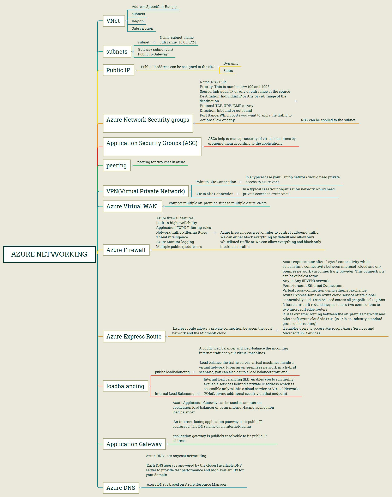
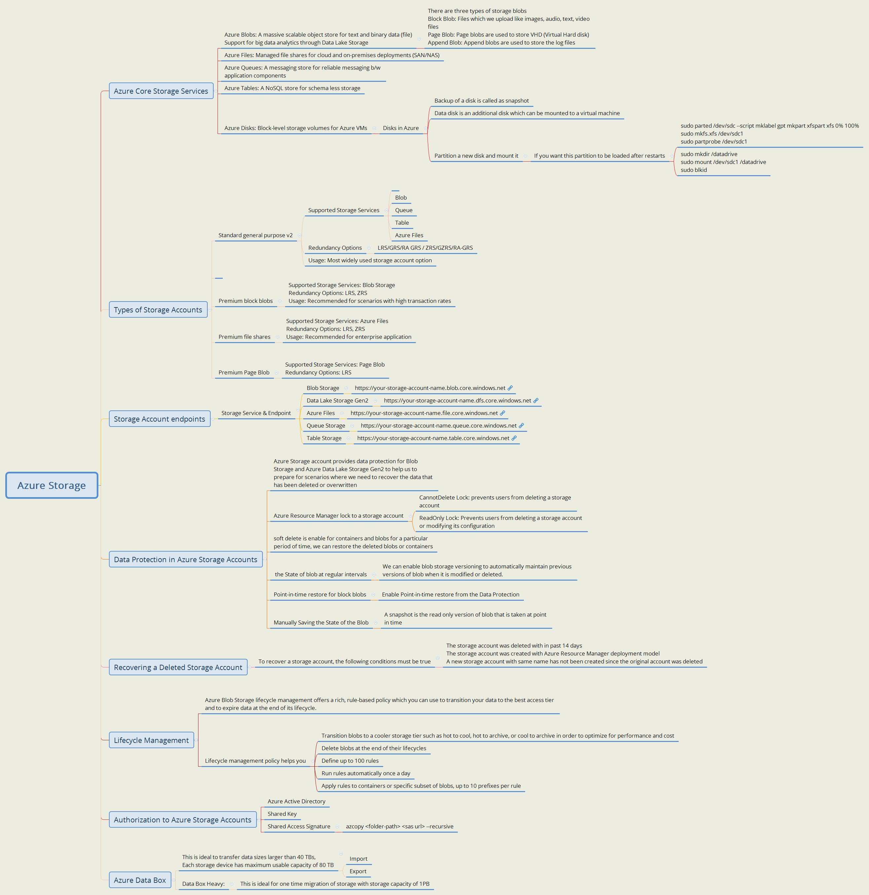
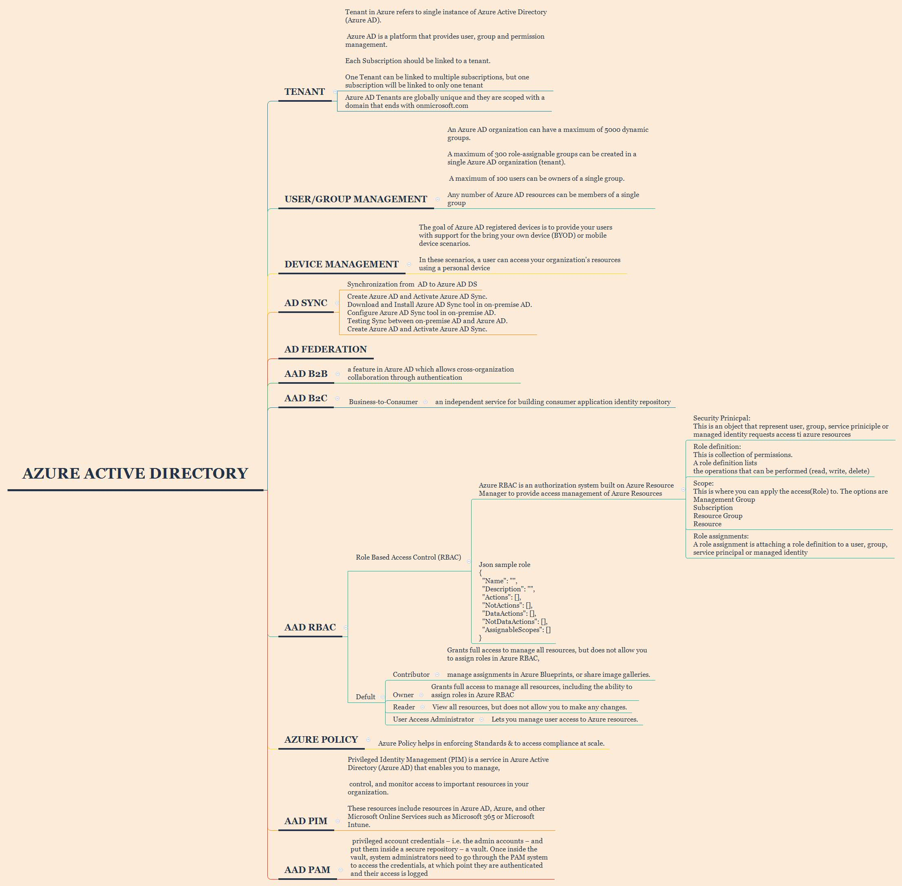
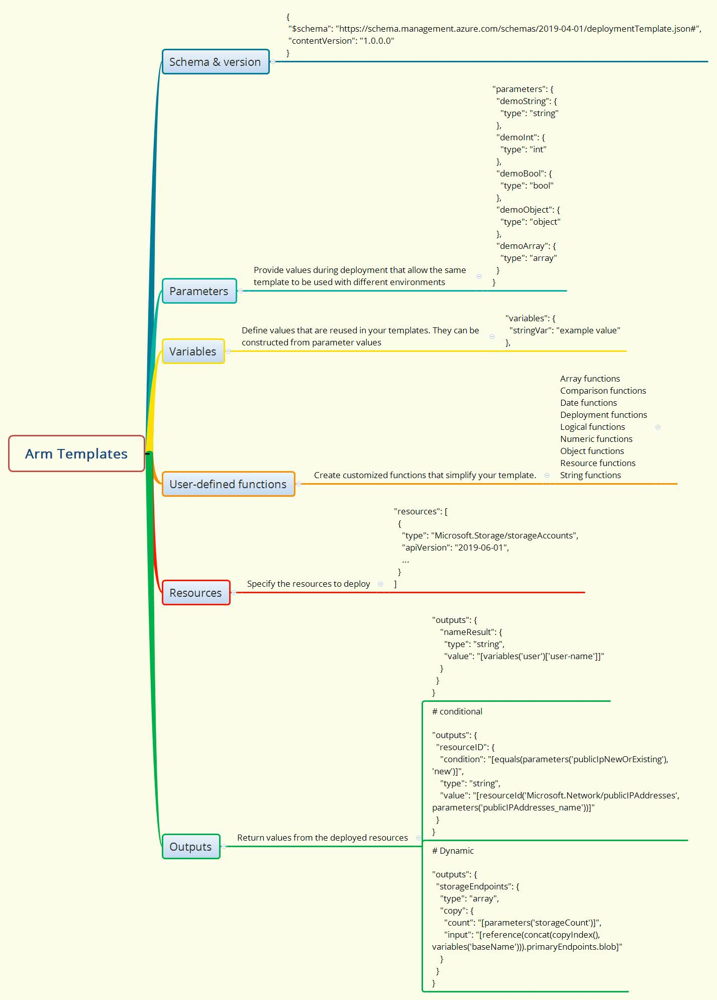

## [Azure Networking Concepts](https://azure.microsoft.com/en-in/product-categories/networking/) 


    Virtual Network
    Load Balancer
    Application Gateway
    VPN Gateway
    Azure DNSContent Delivery Network
    Azure DDoS Protection
    Traffic Manager
    Azure ExpressRoute
    Network Watcher
    Azure Firewall
    Virtual WAN
    Azure Front Door
    Azure Bastion
    Azure Private Link
    Azure Internet Analyzer

## [Azure Storage concepts](https://docs.microsoft.com/en-us/azure/storage/common/storage-decide-blobs-files-disks)


    Blobs
    Data lake Storage Gen2
    Files
    Queues
    Tables
    Disks

## [Azure Database](https://azure.microsoft.com/en-in/product-categories/databases/)
    Azure Cosmos DB
    Azure Database for MySQL
    Azure SQL Database
    Azure Database for PostgreSQL
    SQL Server on Virtual Machines
    Azure Cache for Redis
    Azure Database for MariaDB
    Azure Data Explorer

## [Azure data forctory](https://docs.microsoft.com/en-us/azure/data-factory/introduction)

## [Azure Active Directory](https://docs.microsoft.com/en-in/azure/active-directory/)


    Application management
    Application and HR provisioning
    Authentication
    Business-to-Business (B2B)
    Business-to-Customer (B2C)
    Cloud provisioning
    Conditional Access
    Developers
    Device management
    Domain services
    Enterprise users
    Hybrid identity
    Identity governance
    Identity protection
    Managed identities for Azure resources
    Privileged identity management (PIM)
    Reports and monitoring


## [Azure Monitoring](https://docs.microsoft.com/en-us/azure/azure-monitor/)

```
* Azure management
* Continuous monitoring
* Data sources
* Data Platform
    * Data locations
    * Metrics
    * Logs
    * Log data ingestion time
* Insights
* Monitoring solutions
* Data security
    * Log data
    * Customer-managed keys
    * Personal log data handling
    * Application data collection, retention, and storage
* Alerts
    * Metric alerts
    * Log alerts
    * Activity log alerts
    * Change analysis
* Visualize data
* Partner integrations

```


## [Azure migration](https://docs.microsoft.com/en-us/azure/migrate/troubleshoot-appliance-discovery)

    Assess Hyper-V VMs with Server Assessment
    Assess physical servers with Server Assessment
    Assess servers using imported data
    Migrate VMware VMs with Server Migration
    Migrate Hyper-V VMs with Server Migration
    Migrate physical servers/VMs with Server Migration
    Troubleshoot Azure Migrate
    Database migration
    Replication appliance
[Azure Database Migration Service](https://azure.microsoft.com/en-in/services/database-migration/)Refer here

## [Azure Devloper concepts](https://docs.microsoft.com/en-us/azure/guides/developer/azure-developer-guide)-PaaS

    service Fabric
    app server
    functions

## [ARM-Template](https://docs.microsoft.com/en-us/azure/azure-resource-manager/templates/)


#### Template file


    1. Parameters - Provide values during deployment that allow the same template to be used with different environments.

    2. Variables - Define values that are reused in your templates. They can be constructed from parameter values.

    3. User-defined functions - Create customized functions that simplify your template.

    4. Resources - Specify the resources to deploy.

    5. Outputs - Return values from the deployed resources.

#### Template file Fromat in Json   

```
"resources": [
  {
    "type": "Microsoft.Storage/storageAccounts",
    "apiVersion": "2016-01-01",
    "name": "mystorageaccount",
    "location": "westus",
    "sku": {
      "name": "Standard_LRS"
    },
    "kind": "Storage",
    "properties": {}
  }
]

```
#### Template design 


