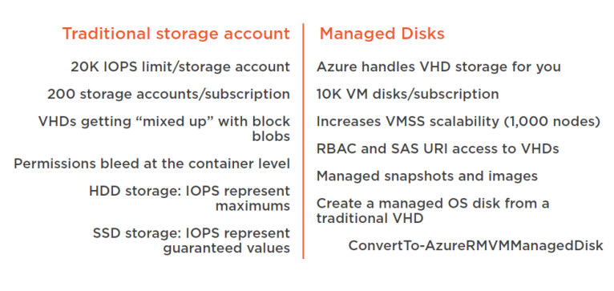

# Azure Storage 


# Storage account Types


## Storage Replication


# AZure VM Disk types


###  ```SATA =Serial Advanced Technology Attachment```
###  ``` SCSI = "Small Computer System Interface"```
## Azure storage classes use cases
### 1. vm Disks


## 2. Unstructured Data


