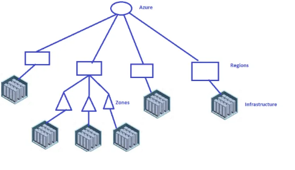
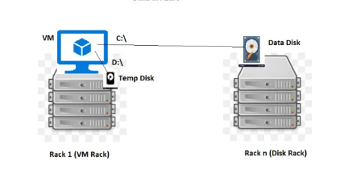

# Storages
### 1. Disk Type:
* Magnetic
* HDD
* SSD
### 2. Backup Criteria:
* How about backup frequency (daily, hourly, weekly)
### 3. Archive Criteria:
* Do I need to archive
### 4. Performance:
* How to improve Performance of Disks/Storage.
### 5. Databases:
* Databases rely a lot on Disks

## Azure Storage Services
* Azure Offers two Services for Storage
1. Storage Account
2. Managed Disk

* Apart from the above mentioned two Services, Azure also offers marketplace images for NetApp, Emc2 etc.

## Azure Storage Account
* One service for all the storage needs offered by Azure.
* Azure Storage Account offers
    1. Disk Storage
    2. Network Storage
    3. Table Storage
    4. Data lake
    5. Queue Storage

## Azure Managed Disk
* For Disk storages to achieve some improvements, Managed Disks were supported.

## Storage Account
    * It is single service for all the storage needs.
## Storage Options in Storage Account
    * Blob:
        * Binary Large Object
        * Generally exposed over https
    * Disk:
        * Hard Disk
    * Azure File Share:
        * Network Disk
    * Table Storage:
        * NoSQL Database
    * Queue Storage:
        * Message Queues

#### Disk Configurations to be considered
    * Hardware:
        * SSD
        * HDD
    * Size:
    * Speed:
        * is measure in IOPS (IO per second)
        * 256 MiB/s => 1 IOPS

### [Refer Blob  cost](https://azure.microsoft.com/en-in/pricing/details/storage/blobs/)

#### Basic Datacenters in Azure

## Storage Account options
* Redundancy

#### Redundancy
##### 1. LRS:
    * Local Redundancy
    * Copies of the data are stored in the same Data Center (Region)
    * Three copies of the data are stored in different racks in the same data center
##### 2. ZRS:
    * Zone Redundancy
    * Copies of the data are stored in different zones of same region
##### 3. GRS:
    * Geo Redundancy
    * One copy of the data will be stored in a different region

## Storage Account Options/Terms
#### Containers:
    Logical grouping of blobs
    Upload any file.
    Individual file cannot have size grater than 4.7 TB
#### Blob Types:
    Block Blob:
    Any file is considered to be block blob.
    File is stored in Blocks. Default Block size is 4MB
#### Page Blob:
    Blob for Hard disk (VHD)
#### Append Blob:
    Log files

#### Performance
#### Account Kind
#### Replication
#### Access Tier

## Azure VM Disks
* DataDisk:
    * Non Ephemeral Storage
    * Can be from Storage Account or Managed Disk
* TempDisk:
    * Ephemeral Storage (Delete the VM data in this disk will be lost)
    * Not from Storage Account or Managed Disk

#### Disk Operations
* Changing Disk Size:
* Yes, when VM is stopped.

#### Adding Disks to VM:
* Tightly Coupled to VM instance Size.

## Storage Account Pricing
* Size of Data Stored
* Data Access

## Account Kind
1. General Purpose V2:
    * Recommendation over General Purpose
    * Access Tier:
        * Hot
        * Cold
* Hot Access Tier:
    * Frequently Accessed Data
        * More charges for storage
        * Less Charges for Access
* Cold Access Tier
    * Infrequently Accessed Data
        * Less Charges for Storage
        * More Charges for Access
* Access Tier can be selected for
    * Container
    * Blob
    * Storage Account

2. General Purpose:
    * Same pricing for all the blobs.
3. Blob Storage:
    * Specifically for blob data.

### Storage Account Performance
1. Standard:
    * Speed promised is Upto.
2. Premium
    * Speed promised is guaranteed.
3. Storage Account Performance is shared across all the disks inside the account.

4. Individual Disk Performance is possible only when your storage account has only one disk.

#### Managed Disks in Azure
* [Refer Here](https://docs.microsoft.com/en-us/azure/virtual-machines/windows/managed-disks-overview)

* Individual Disk Performance

* Better Speeds (IOPS) and Sizes

* For Disk Types [Refer Here](https://docs.microsoft.com/en-us/azure/virtual-machines/windows/disks-types)

* SSD

    * Standard
    * Premium
    * Ultra
* HDD
    * Standard
* Reserved Disks:

    * Give 1 year commitment to Azure about a specific disk in a region and you can gain discounts.

* Managed Disk is default disk for VMs

* Encryption:

    * Encryption At Rest: Encrypt the data stored in Azure with Azure Vault.
    * Client Encrypt: Encrypte by the Client and Sent to Azure.

* VM has a Disk. Disk Backup is Snapshot.

* From Snapshot, Disk can be created.

* From Disk VM Can Be created.

#### Azure File Share.
* Creates SMB Share.
* Can be mounted on Windows, Linux and Mac
* Supports Snapshots

#### Azure Storage Explorer
* Download Azure Storage Explorer [from here](https://azure.microsoft.com/en-in/features/storage-explorer)
* Desktop tool for storage account operations.

#### Block Blob
* All the Data Stored in Storage account can be accessed over https urls.
* This helps us in following use cases
    * Cloud Storage for files (Google Drive, One Drive)
    * Streaming Applications (Netflix, Amazon Prime)
    * Host static websites (Websites with only html, css and javascript) can be directly hosted on Storage accounts.
* Access Level
    * Private
    * Public

* Storage Account Access can be given to specific users by
    * Access Key/Token based approach
* Life cycle can be defined
    * Hot Tier => Cold Tier => Archive
    * When to change access tiers can be defined as a policy

#### Edge Locations and CDN (Content Delivery Networks)
POP(Point of Presence Locations) [Refer Here](https://docs.microsoft.com/en-us/azure/cdn/cdn-pop-locations)

