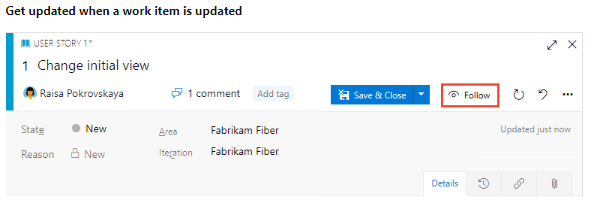

## 1. Azure Boards


### work item: [Refer here for more](./images/work_item.md)
    You add work items to plan and manage your project. You use different types of work items to track different types of work—such as user stories or product backlog items, tasks, bugs, or issues. You can describe the work to be done, assign work, track status, and coordinate efforts within your team.


### Boards
    Azure Boards provides you with a set of predefined work item types to support tracking features, user stories, bugs, and tasks. You can quickly get up and running by using your product backlog or Kanban board. ... Quickly add work items by using your backlog or Kanban board

### Queries   [refer here](https://docs.microsoft.com/en-us/azure/devops/boards/queries/using-queries?view=azure-devops)
    Managed queries generate a list of work items based on the filter criteria you provide. You can create queries from the web portal or from a supported client, such as Visual Studio Team Explorer and Team Explorer Everywhere. Also, you can open a query in Excel to perform bulk additions and modifications.


## Dashboard:
    Gain visibility into your team's progress by adding one or more widgets or charts to your dashboard. Customizable, highly-configurable dashboards provide you and your teams with the flexibility to share information, monitor progress and trends, and improve your workflow processes. Each team can tailor their dashboards to share information and monitor their progress.

[refer here](https://docs.microsoft.com/en-us/azure/devops/report/dashboards/overview?view=azure-devops)


# Plan work with Azure Boards

## 1. build your board and backlog

### Azure Boards | Azure DevOps Server 2019 | TFS 2018 | TFS 2017 | TFS 2015 | TFS 2013

* Your product backlog corresponds to your project plan, the roadmap for what your team plans to deliver. You create your product backlog by adding user stories, backlog items, or requirements.

* After you define it, you have a prioritized list of features and requirements to build. Your backlog also provides a repository of all the information you need to track and share with your team.

* Your backlog consists of a list of work items. You use work items to share information, assign work to team members, track dependencies, organize work, and more. Because the most important work appears at the top of the list, your team always knows what to work on next.


### ``` Prerequisites ```
* You must connect to a project. If you don't have a project yet, create one.
* You must be added to a project as a member of the Contributors or Project Administrators security group. 
* To get added, Add users to a project or team.
* To add or modify work items, you must be granted Stakeholder access or higher. For details, see About access levels.
* To view or modify work items, you must have your View work items in this node and Edit work items in this node permissions set to Allow. By default, the Contributors group has this permission set.
* To learn more, see Set permissions and access for work tracking.

### Track work on interactive backlogs and boards

* Quickly add and update the status of work using the Kanban board. 
* You can also assign work to team members and tag with labels to support queries and filtering. 
* Share information through descriptions, attachments, or links to network shared content. 
* Prioritize work through drag-and-drop.

* Quickly add and update the status of work using the Kanban board. 
* You can also assign work to team members and tag with labels to support queries and filtering. 
* Share information through descriptions, attachments, or links to network shared content. 
* Prioritize work through drag-and-drop.


### Collaborate
* Collaborate with others through the Discussion section of the work item form. 
* Use @mentions and #ID controls to quickly include others in the conversation or link to other work items. * * Choose to follow specific issues to get alerted when they are updated.



* Create dashboards that track status and trends of work being accomplished. 
* Set notifications to get alerted when an issue is created or changed.


### Open the Kanban board
* A Kanban board is provisioned with the addition of each project and each team. 
* You can only create or add Kanban boards to a project by adding another team.


* The Epics Kanban board is the best tool for quickly adding epics and issues that are children of those epics. 
* To open the Epics board from the Issues board, choose Epics from the board selector.


### Add issues or user stories


### Add details to an issue or user story

* Choose the issue or user story title to open it. 
* Change one or more field values, add a description, or make a note in the Discussion section. 
* You can also choose the attachments icon Attachments tab and drag-and-drop a file to share the file with others


[Refer here](https://docs.microsoft.com/en-in/azure/devops/boards/get-started/plan-track-work?view=azure-devops&tabs=agile-process#add-details-to-an-issue-or-user-story) for Field Description and update status

## 2. run sprint [Refer here ](https://docs.microsoft.com/en-us/azure/devops/boards/sprints/scrum-overview?view=azure-devops) For more information

``` You add Iteration Paths to support teams who implement Scrum or use sprint planning to group work items based on a time-box interval or sprint. ... Area Paths and Iteration Paths are also referred to as Classification Nodes ```


## 3. Track your important work [Refer here](https://docs.microsoft.com/en-us/azure/devops/boards/get-started/plan-track-work?view=azure-devops&tabs=basic-process)


