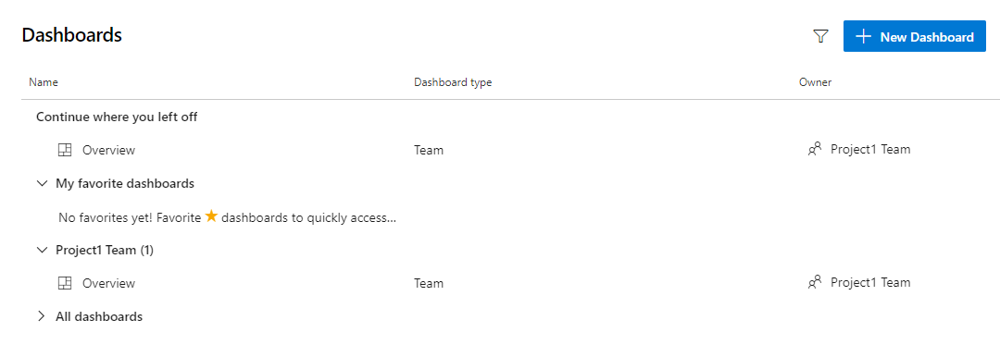
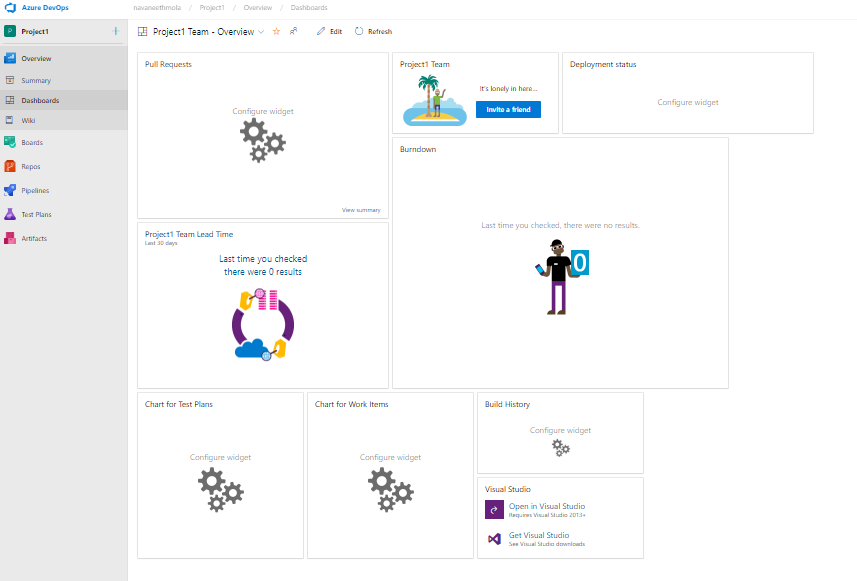
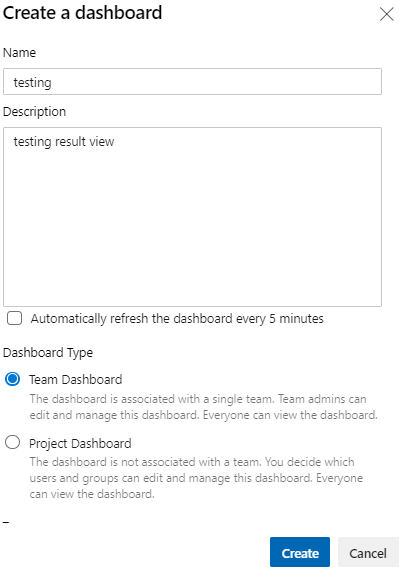
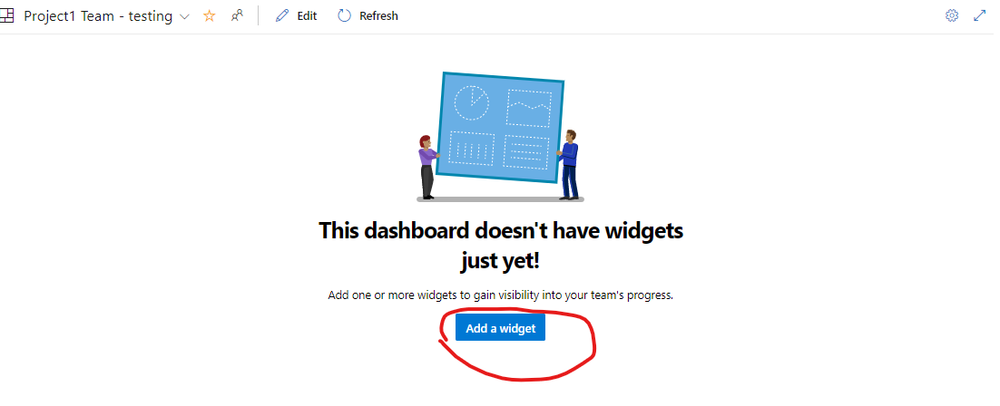
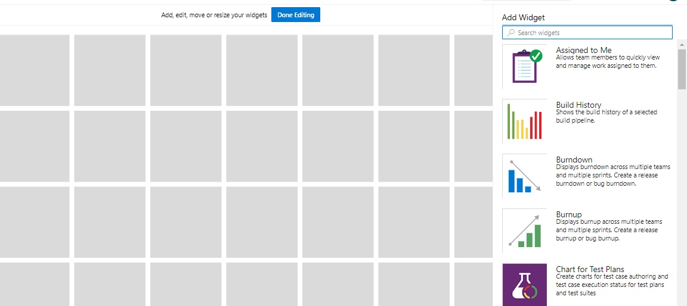
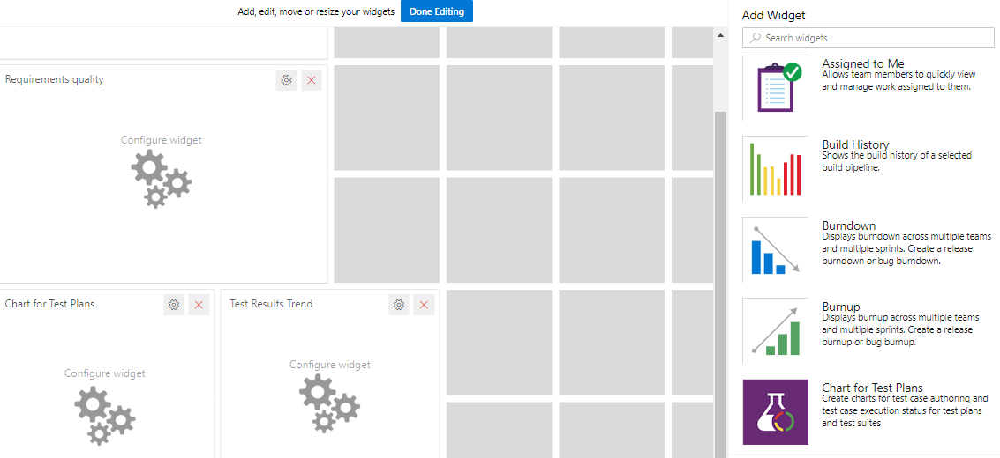
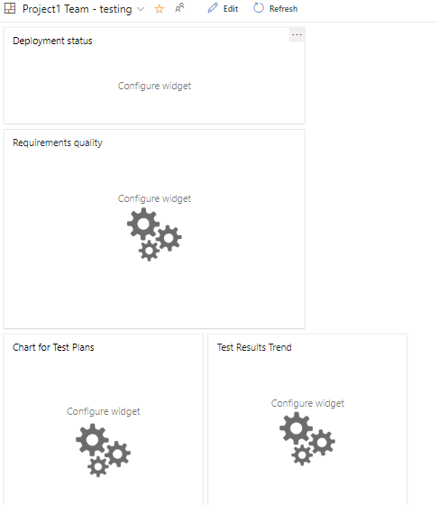

## over view of Dashboard

# 1. Dashboard
* Gain visibility into your team's progress by adding one or more widgets or charts to your dashboard. 

* Customizable, highly-configurable 
* dashboards provide you and your teams with the flexibility to share information, monitor progress and trends, and improve your workflow processes. 

* Each team can tailor their dashboards to share information and monitor their progress.

# 2.Key concepts
#### Dashboards
* Dashboards are customizable interactive signboards that provide real-time information. 
* Dashboards are associated with a team or a project and display configurable charts and widgets.
#### Charts
* Charts are query-based status or trend charts derived from a work item query or test results.

#### Widgets
* Widgets display configurable information and charts on dashboards. 
* The widget catalog provides brief descriptions of those widgets available to you. In addition, you can add widgets provided through the Azure DevOps Marketplace.

#### In-context reports
* In-context reports are system-generated charts that support specific services. 
* Examples are team velocity, sprint burndown, and the Cumulative Flow Diagram (CFD), and the Test Failures Report. 
* These reports are displayed on the Analytics tab for a specific service and derive data from Analytics.
##### Power BI reports
* Power BI reports allow users to create rich, customized Power BI reports or other reports using OData queries of Analytics data and the returned JSON data.

## sample 

## click on New Dashboard

## Open Dashboard and Select the required widget

## Search the widget and select the required application

## Drag and Drop The widget on the Dashboard and save the editing

## see the dashboard on the screen with required widgets

