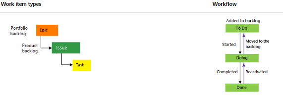
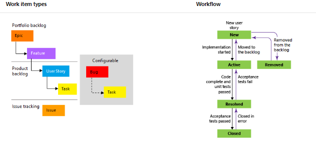

# work_item

#### Two of the most popular processes used are Basic and Agile. A process determines the work item types and workflow available in Azure Boards.

# 1.Basic Process
* Basic provides three work item types
    1. epics 
    2. issues
    3. tasks 
* it is very simple workflow. As works progresses from not started to completed, you update the State workflow field from To Do, Doing, and Done.

* When you add an issue, task, or epic, you create a work item. Each work item represents an object stored in the work item data store. Each work item is assigned an identifier. The IDs are unique within your projects.

* Add epics to track significant features or requirements. Use issues to track user stories, bugs, or other smaller items of work. And, use tasks to track even smaller amounts of work for which you want to track time either in hours or days.

# 2. Agile Process 

* The Agile process provides several work item types
    * user stories 
    * bugs 
    * features 
    * epics 
    * tasks 
* As works progresses from not started to completed, you update the State workflow field from New, Active, Resolved, and Closed.

* When you add a user story, bug, task, or feature, you create a work item. Each work item represents an object stored in the work item data store. Each work item is assigned a unique identifier (ID) within your projects.

* Add epics to track significant business initiatives. Add features to track specific applications or set of work. Define user stories to track work that you'll assign to specific team members, and bugs to track code defects. Lastly, use tasks to track even smaller amounts of work for which you want to track time either in hours or days.

