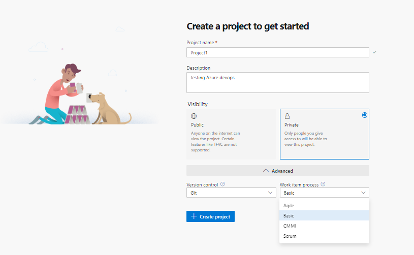

## Azure_devops

#### Azure DevOps (Visual Studio Team Services)
* Is collection of Services/Tools to perform whole Project Management (majorly Agile)
* [Refer Here](https://docs.microsoft.com/en-us/azure/devops/?view=azure-devops) for azure devops official documentation
* Azure DevOps can be used in two modes
    * Azure Cloud (Zero Installation/Hosted)
    * Azure DevOps Server (Self Hosted)
* Azure DevOps Services
[Refer Here](https://docs.microsoft.com/en-us/azure/devops/user-guide/services?view=azure-devops)

#### VSTS Terms Equivalent in Jenkins

* Master => Azure DevOPs Server
* Node => Agent
* Free Style Project => Classic UI
* Jenkins File (Groovy) => Pipeline Spec (YAML)
## Extenstions for Azure devops [Refer here](https://marketplace.visualstudio.com/azuredevops)

# To Create organization

## Open Azuredevops server and select the project and click on create New project 




## Open the project 


## In This project we have main concepts

 


## concepts in Azure-devops

## 1. Dashboards [Refer_here](./Dashboard.md)Documentation overview of Dashboard

## 2. Wiki       [Refer_here](./wiki.md)Documentation


## 3. Azure Boards [Refer here](./Azure_boards.md)

## 4. Azure Pipeline [Refer Here](./images/Azure_pipeline.md)

## 5. Azure Repo [Refer here](./Azure_repo.md)

## 6. Azure test plans [Refer here](./Azure_testplans.md)

## 7. Azure Artifacts [Refer here](./Artifacts.md)


#### What is Agile
[Refer here](https://docs.microsoft.com/en-us/azure/devops/learn/agile/what-is-agile) Required document

#### What is Scrum
```
Scrum is a framework used by teams to manage their work. Scrum implements the principles of Agile as a concrete set of artifacts, practices, and roles.

This article provides a basic description of Scrum. At the end, you’ll find helpful resources if you want to dig in more.

```

#### The Scrum lifecycle


#### Scrum Roles
```
Scrum prescribes three specific roles…
```
#### Product Owner
```
Responsible for what the team is building, and why they’re building it. The product owner is responsible for keeping the backlog up-to-date and in priority order.
```
#### Scrum Master
```
Responsible to ensure the scrum process is followed by the team. Scrum masters are continually on the lookout for how the team can improve, while also resolving impediments (blocking issues) that arise during the sprint. Scrum masters are part coach, part team member, and part cheerleader.
```
#### Scrum Team
```
These are the individuals that actually build the product. The team owns the engineering of the product, and the quality that goes with it

```

#### Product Backlog
    The Product Backlog is a prioritized list of value the team can deliver. The Product Owner owns the backlog and adds, changes, and reprioritizes as needed. The items at the top of the backlog should always be ready for the team to execute on.

#### Sprint Planning and Sprint Backlog
    In Sprint Planning, the team chooses the backlog items they will work on in the upcoming sprint. The team chooses backlog items based on priority and what they believe they can complete in the sprint. The Sprint Backlog is the list of items the team plans to deliver in the sprint. Often, each item on the Sprint Backlog is broken down into tasks. Once all members agree the Sprint Backlog is achievable, the Sprint starts.

#### Sprint Execution and Daily Scrum
    Once the Sprint starts, the team executes on the Sprint Backlog. Scrum does not specify how the team should execute. That is left for the team to decide.

    Scrum defines a practice called a Daily Scrum, often called the Daily Standup. The Daily Scrum is daily meeting limited to 15 minutes. Team members often stand during the meeting, to ensure it stays brief. Each team member briefly reports their progress since yesterday, the plans for today, and anything impeding their progress.

To aid the Daily Scrum, teams often review two artifacts:

#### The Task Board
    Lists each backlog item the team is working on, broken down into the tasks required to complete it. Tasks are placed in To Do, In Progress, and Done columns based on their status. It provides a visual way of tracking progress for each backlog item.


#### The Sprint Burndown
    A graph that plots the daily total of remaining work. Remaining work is typically in hours. It provides a visual way of showing whether the team is “on track” to complete all the work by the end of the Sprint.


#### Sprint Review and Sprint Retrospective
At the end of the Sprint, the team performs two practices:

#### Sprint Review
The team demonstrates what they’ve accomplished to stakeholders. They demo the software and show its value.

#### Sprint Retrospective
The team takes time to reflect on what went well and which areas need improvement. The outcome of the retrospective are actions for next sprint.

#### Increment
The product of a Sprint is called the “Increment” or “Potentially Shippable Increment”. Regardless the term, a Sprint’s output should be of shippable quality, even if it’s part of something bigger and can’t ship by itself. It should meet all the quality criteria set by the team and Product Owner.

#### Repeat. Learn. Improve.
The entire cycle is repeated for the next sprint. Sprint Planning selects the next items on the Product Backlog and the cycle repeats. While the team is executing the Sprint, the Product Owner is ensuring the items at the top of the backlog are ready to execute in the following Sprint.

This shorter, iterative cycle provides the team with lots of opportunities to learn and improve. A traditional project often has a long lifecycle, say 6-12 months. While a team can learn from a traditional project, the opportunities are far less than a team who executes in 2-week sprints, for example.

This iterative cycle is, in many ways, the essence of Agile.

Scrum is very popular because it provides just enough framework to guide teams, while giving them flexibility in how they execute. Its concepts are simple and easy to learn. Teams can get started quickly and learn as they go. All of this makes Scrum a great choice for teams just starting to implement Agile principles.

#### kanban
[referhere](https://docs.microsoft.com/en-us/azure/devops/learn/agile/what-is-kanban)